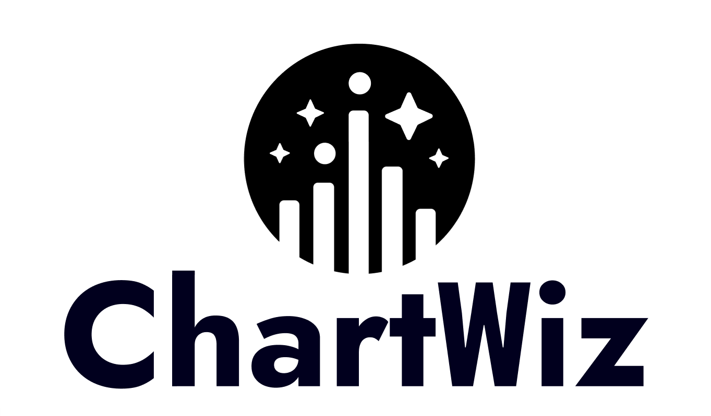

# ChartWiz

- Korean Large Language and Vision Assistant For Chart(feat. LLaVA with Deplot)
- 차트 이미지 기반 질의 응답이 가능한 멀티모달 Chart QA 모델


## 환경 세팅

1. Anaconda3로 conda 가상환경 생성
2. python 버전 : 3.10.12
3. cuda 버전 : 12.2
4. cudnn 버전 : 8.9.2
(nvidia docker file : https://docs.nvidia.com/deeplearning/frameworks/pytorch-release-notes/rel-23-09.html)

## Install
1. git clone 이후 ChartWiz 디렉토리로 이동
```
git clone https://github.com/allright2024/ChartWiz.git
cd ChartWiz
```
2. 라이브러리 설치
```
conda create -n chartwiz python=3.10.12 -y
conda activate chartwiz
pip install --upgrade pip
pip install -e .
```
3. 학습을 할 경우 추가 라이브러리 설치
```
pip install -e ".[train]"
pip install flash-attn --no-bild-isolation
```

## inference
미리 question 파일을 준비하여 여러 질문에 대한 결과를 한꺼번에 보고 싶으면 아래의 명령어를 입력하시면 됩니다.
```
./scripts/infer.sh
```
만약 질문을 하나씩 하고 싶다면 아래의 명령어를 실행하여 웹사이트를 통해 하시면 됩니다.
```
pip install streamlit
./web_demo_beta.sh
```

## Training 
ChartWiz의 학습은 두 단계에 걸쳐 진행됩니다.  
##### 1. Pretraining
AI-hub 데이터의 각 차트 이미지에 대한 annotations 데이터 240K를 전처리하여 table 데이터를 추출합니다.  
Pretraining 단계에서는 vision encoder와 LLM을 연결하는 projection layer만을 학습합니다.
##### 2. Finetuning
AI-hub에서 제공한 240K 개의 차트 이미지에 대하여 상세서술, 요약, 테이블 데이터를 추출하여 총 720K개의 데이터로 학습을 하며, GPT로 생성한 240K개의 데이터로 학습을 진행합니다.  
Finetuning 단계에서는 Projection Layer와 LLM을 학습합니다.  
  

Chart Wiz는 4 A100 GPUs(40GB) 총 80GB로 학습했으며, GPU VRAM 크기에 따라 ```per_device_train_batch_size```를 조절하고, ```gradient_accumulation_steps```도 마찬가지로 조절하면 됩니다.

### 데이터셋 구성 방법
AI-hub 차트 이미지-텍스트 데이터 쌍 데이터 준비
--> 아래와 같이 디렉토리를 구성

- train
    - img_data
        - img_etc_mix
            - img_files(.jpg)
        - img_etc_radial
        - img_horizontal bar_100per accumulation
        - img_horizontal bar_accumulation
        - img_horizontal bar_standard
        - img_line_standard
        - img_pie_standard
        - img_vertical bar_100per accumulation
        - img_vertical bar_accumulation
        - img_vertical bar_standard
    - text_data
        - text_etc_mix
            - json_files(.json)
        - text_etc_radial
        - text_horizontal bar_100per accumulation
        - text_horizontal bar_accumulation
        - text_horizontal bar_standard
        - text_line_standard
        - text_pie_standard
        - text_vertical bar_100per accumulation
        - text_vertical bar_accumulation
        - text_vertical bar_standard
- test
    - img_data
        - img_etc_mix
            - img_files(.jpg)
        - img_etc_radial
        - img_horizontal bar_100per accumulation
        - img_horizontal bar_accumulation
        - img_horizontal bar_standard
        - img_line_standard
        - img_pie_standard
        - img_vertical bar_100per accumulation
        - img_vertical bar_accumulation
        - img_vertical bar_standard
    - text_data
        - text_etc_mix
            - json_files(.json)
        - text_etc_radial
        - text_horizontal bar_100per accumulation
        - text_horizontal bar_accumulation
        - text_horizontal bar_standard
        - text_line_standard
        - text_pie_standard
        - text_vertical bar_100per accumulation
        - text_vertical bar_accumulation
        - text_vertical bar_standard

### Pretrain 데이터 준비
ChartWiz에서 Pretrain 단계는 Projection Layer를 학습하는 단계이며 데이터를 처리할 때도 이미지에 대한 Instruction 없이 Image 자체에 대하여 학습을 합니다.  
그래서 차트 이미지에 대하여 일반적인 학습을 하기 위해서는 차트 상세 설명 데이터 혹은 차트 테이블 데이터로 학습을 진행해야 하는데, 저희는 테이블 데이터로 학습하기로 정했습니다.  
테이블 데이터를 구축하기 위해서는 AI-hub 데이터에서 annotations로 부터 정보를 추출해야합니다.  
코드는 preprocess폴더의 make_table_data.py에 있습니다.

### fintuning 데이터 준비 
finetuning 데이터는 상세 서술, 테이블, 요약, 질의 응답 데이터로 이루어져 있습니다. 
각각의 데이터는 Instruction-Following 형식으로 정리가 되어야 하는데 이 코드도 마찬가지로 preprocess폴더의 make_finetuning_data.py에 있습니다. 

## 학습 방법
Pretrain을 통해 Projection Layer를 생성해 줍니다.
Run
```
./scripts/pretrain.sh
```
Finetuning을 통해 LLM 학습을 시작하고, Projection Layer를 추가적으로 학습해줍니다.
```
./scripts/finetune.sh
```
만약 GPU메모리가 부족하다면 LoRA로 학습할 수 있습니다.
```
./scripts/finetune_lora.sh
```
## 각 결과에 대한 inference
일반적인 finetuning을 한 경우
```
./scripts/infer.sh
```
LoRA로 finetuning을 한 경우
```
./scripts/lora_infer.sh
```
## TEAM
ChartWiz 프로젝트는 성균관대학교 산학 지도 교수 박희선 교수님과 하계산학 집중 학습 구성원들과 함께 진행했습니다.


